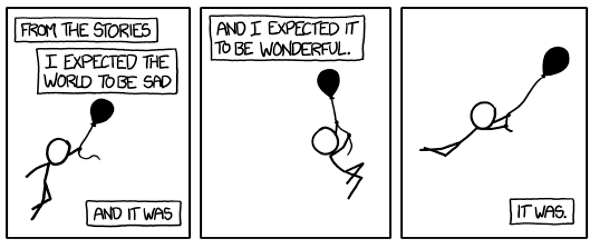

<h2> < Hello World, I'm <a href="https://www.linkedin.com/in/bocan/" target="_blank">Chris Funderburg</a> /> </h2>
    
    

    
    
- I'm a freelance consultant Cloud Architect / Devops Engineer and run my own company: <a href="https://cloudcauldron.io/" target="_blank">Cloud Cauldron Limited</a>.
- We're currently working with <a href="https://www.pitchup.com/" target="_blank">Pitchup.com</a>, which is booking system for campsites, caravan parks, and glamping. They help not just with somewhere to stay, but with local bike info, walking routes, pubs (of course) and nearby events.  We're helping them by providing some Google Cloud and Kubernetes expertise, working through their small amount of technical debt, and building a more sustainable and secure systems platform to allow them to grow safely.
- In my youth, I worked at Burger King, washed oil rigs so they could be sold, loaded nuclear and non-nuclear munitions onto F-111 and F-16 aircraft in the US Air Force, worked as a an mechanic and then a roofer.  Now, I have more than 25 years experience in the IT industry. I've been a developer, a DBA, a system administrator, a release engineer, an infrastructure manager, a NOC engineer, and both a cloud engineer, and devops lead.
- I'm an expert in public clouds like AWS and Google Cloud, infrastructure as code, container building and orchestration, database administration, observability, and software delivery pipelines using Continuous Integration and Continuous Deployment.    
- Outside of tech, I'm an keen photographer, an environmentalist (with an Open University Bachelor of Science in "Environmental Management and Technology"), an allotment gardener, a charity trustee, and an occasional Nintendo Switch, Playstation 5, and PC gamer.
- 📩 Feel free to reach me at chris@cloudcauldron.io.

<h2>📣 Advice Bot!</h2>

<h2>🛠 My Toolkit</h2>

<h2>🏆 Github Stats</h2>

 
   
   
  

<h2>🤝 Let's stay connected!</h2>

<a href="https://www.linkedin.com/in/bocan/" target="_blank">LinkedIn</a>&nbsp;<a rel="me" href="https://mastodon.online/@bocan">Mastodon</a>  
     
     

    
<h2>"Know, O Prince,</h2>
    
that between the years when the oceans drank Microsoft DOS and the gleaming Windows, and the rise of "The Cloud", there was an Age undreamed of, when shining servers lay spread across the world like blue mantles beneath the stars - Debian, FreeBSD, Slackware, AIX, Solaris with its dark-haired sales women and server towers of spider-haunted mystery, SuSE with its chivalry, Caldera that bordered the pastoral lands of SCO, OpenBSD with its shadow-guarded passwords, RedHat whose Sys Admins wore steel and silk and gold. But the proudest kingdom of the world was Mac OS, reigning supreme in the dreaming west. Hither came Chris the Texan, little-haired, sullen-eyed, MacBook in hand, a builder, a programmer, a sys-admin, a devops engineer, with gigantic melancholies and gigantic mirth, to tread the jewelled server rooms of the earth under his sandled feet."
